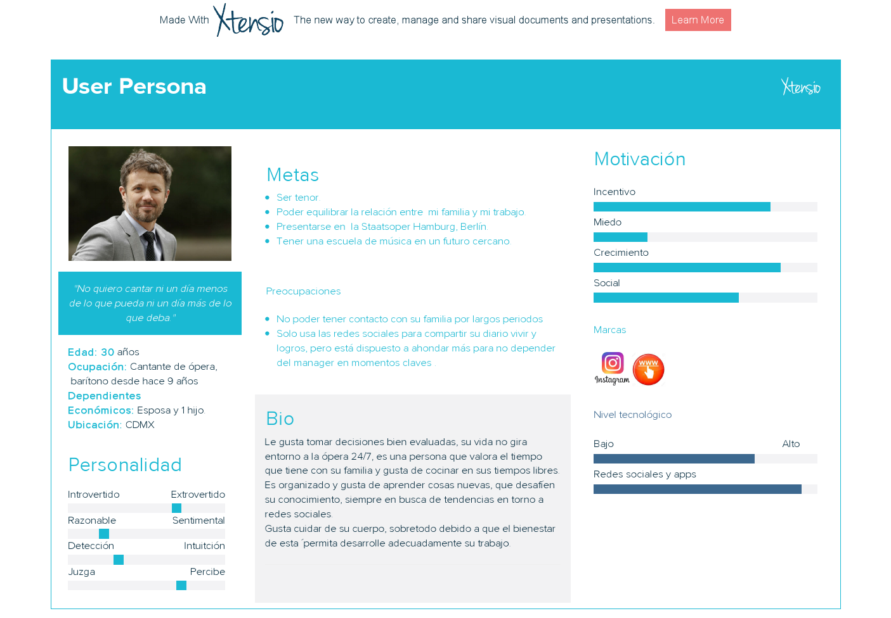

El concepto de user persona es de vital importancia a la hora de diseñar una buena estrategia de desarrollo y venta de un producto o servicio.Cuanto mejor conozcamos a nuestros clientes, más posibilidades tendremos de ofrecerles el producto que realmente están buscando.
Normalmente se crean Personas antes de la etapa del diseño de User Journey y User Flow, los cuales también necesitan usar los datos usados en la creación de Persona. Y una Persona bien diseñada puede facilitar y perfeccionar directamente el resultado del diseño de User Journey y User Flow.

Una ficha de user persona debería contener, al menos, los siguientes elementos:

Encabezado. Este apartado será el que facilite en mayor medida la visualización del cliente ficticio y, por tanto, ayude a tener su imagen más presente a lo largo de todo el proceso. En este sentido, el encabezamiento debe incluir el nombre ficticio de la user persona, una foto representativa y, opcionalmente, una breve cita o lema que, de algún modo, identifique al cliente.
Perfil demográfico. Se trata en este punto de reflejar el resultado de la investigación de datos realizada en la fase inicial. De este modo, se recogerá aquí la información relativa a edad, género, educación, situación personal y profesional, intereses, motivaciones, etc.
Metas y objetivos, es decir, qué es aquello que el cliente quiere alcanzar mediante tu producto o servicio. Este elemento suele ser, en última instancia, uno de los factores principales en la motivación de compra.
Contexto o escenario. Nos referimos aquí a la descripción del contexto específico en que el usuario va a utilizar el producto. Trataremos también de determinar de qué modo influye dicho escenario en la consecución de sus objetivos, qué opciones tiene a su alcance, etc.
Comportamiento. Se trata de definir las acciones más probables que llevaría a cabo el usuario en el marco del escenario que has identificado en el punto anterior.

